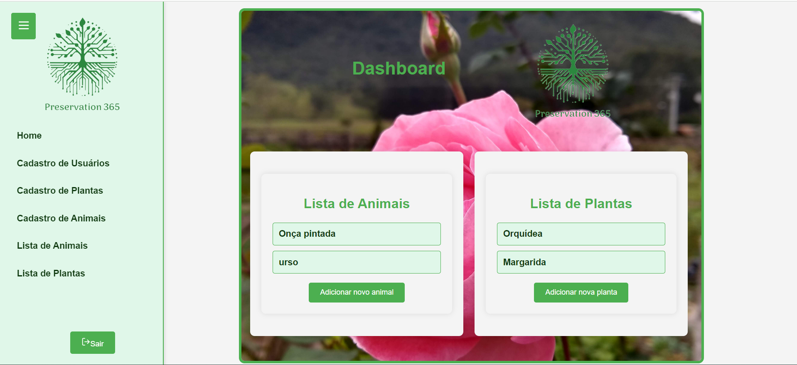

# Preservation365 🌿

# Projeto Final - Preservation365 - Por Leiliane Costa ✒️

## 📌 Descrição do Projeto 
O Preservation365 é uma aplicação web que permite a criação de usuários, login, listagem e cadastro de plantas e animais. Além disso, oferece detalhes sobre as plantas cadastradas, exclusão e edição de itens. Este projeto visa facilitar o gerenciamento e a preservação de informações sobre a fauna e flora.

## 💡 Problema que Resolve 
O Preservation365 resolve o problema de gerenciamento e organização de informações sobre plantas e animais, permitindo que os usuários cadastrem, visualizem, editem e excluam dados de forma eficiente e centralizada.

## 💻 Funcionalidades
- Adicionar usuários, plantas e animais
- Login
- Visualizar listas de animais e plantas salvos
- Excluir e editar itens

## 🚀 Tecnologias Utilizadas

- **Frontend**:
- HTML, CSS, JavaScript, ReactJS, Context API

- **Backend**:
- NodeJS, JSON Server

- **Persistência de Dados**:
- LocalStorage

## ⚙️ Instalação
Para rodar esta aplicação localmente, siga estes passos:
1. Clone este repositório para sua máquina: git clone https://github.com/leilianelcs/preservation365.git
2. No terminal, instale as dependências: `npm install`
3. Rode a aplicação: `npm run dev`
4. Abra `http://localhost:5173/` em seu navegador para visualizar a aplicação.

## 🙋 Tela Dashboard

## ⌨️ Cadastrando Usuários
Para adicionar um novo usuário, siga os passos abaixo:
1. Digite o nome, email, CPF e senha do usuário nos campos de texto.
2. Clique no botão "Cadastrar".

## ⌨️ Adicionando Plantas
Para adicionar uma planta, siga os passos abaixo:
1. Digite o nome, habitat e descrição da planta nos campos de texto.
2. Clique no botão "Cadastrar"

## ⌨️ Adicionando Animais
Para adicionar um novo animal, siga os passos abaixo:
1. Digite o nome, habitat e características do animal nos campos de texto.
2. Clique no botão "Cadastrar"

## 📈 Melhorias Futuras 
Implementação de autenticação JWT para maior segurança.
Integração com uma API externa para obter informações adicionais sobre plantas e animais.
Adição de funcionalidades de busca e filtragem avançadas.
Melhorias na interface do usuário para uma experiência mais intuitiva.

## 🖇️ Projeto orientado por:
- Profº Nicholas Macedo
- Profº Yan Esteves

## 📄 Licença
Este projeto está sob a licença MIT. Consulte o arquivo LICENSE para obter mais detalhes.

## ✍ Contribuições 💡 
Contribuições são sempre bem-vindas! Para contribuir:
1. Faça um fork do projeto.
2. Crie uma nova branch com sua feature (`git checkout -b feature/novaFeature`).
3. Faça commit das suas contribuições (`git commit -m 'Adicionando uma nova feature'`).
4. Faça push para a branch (`git push origin feature/novaFeature`).
5. Abra um Pull Request.

## 📞 Contato 
- [@leilianelcs](https://www.github.com/leilianelcs)
- 📫 leilianelcs@gmail.com

### 🤝 Agradecimentos
Obrigada por conferir o projeto! Sinta-se à vontade para contribuir e compartilhar suas sugestões.

## FloripaMaisTec - FuturoDEV/Nature - Módulo 02 - Front-End 🌟